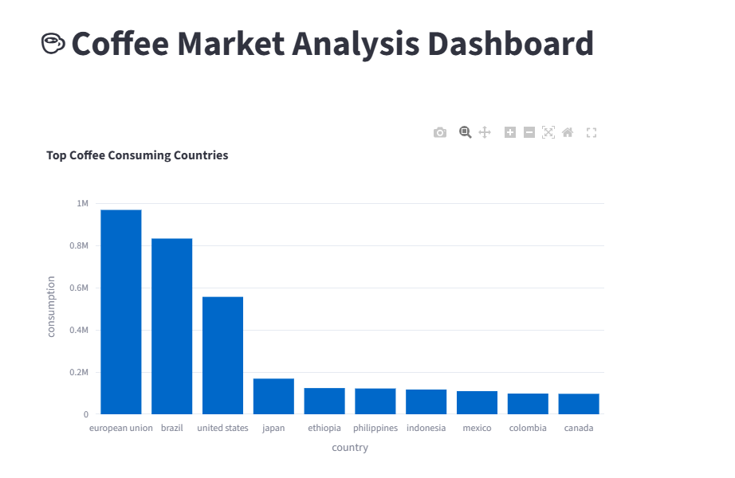
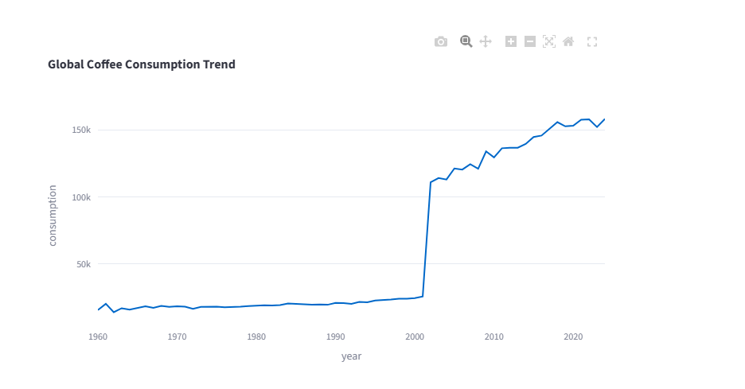
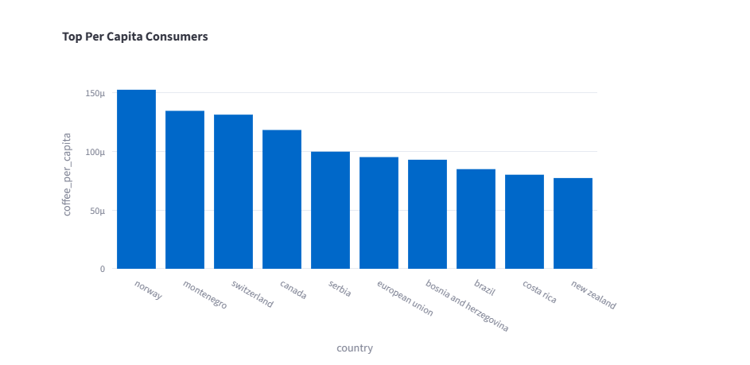

# ☕ Coffee Market Analysis Dashboard

🚀 End-to-end data analytics project using **Python, PostgreSQL, SQL, and Streamlit** to identify global coffee market opportunities.

---

## 📊 Dashboard Preview





---

## 🧰 Tech Stack

- 🐍 Python (pandas, numpy)
- 🗄️ PostgreSQL (Neon Cloud)
- 🧾 SQL (Data Transformations)
- 📊 Streamlit & Plotly (Dashboard)

---

## ⚙️ Project Workflow

✅ Data Collection from 3 sources  
✅ Data Cleaning & Standardization  
✅ Handling country mismatches  
✅ Data Integration (Merge datasets)  
✅ Feature Engineering (Per Capita Consumption)  
✅ PostgreSQL Data Model  
✅ SQL Analysis  
✅ Interactive Dashboard  

---

## 📈 Key Insights

### 🌍 Top Coffee Markets
- 🇺🇸 United States  
- 🇧🇷 Brazil  
- 🇪🇺 European Union  

### 📊 Observations
- Coffee consumption has **grown significantly after 2000**
- Developed regions show **strong per capita consumption**
- Emerging markets show **scalability potential**

---

## 🏆 Business Recommendation

✅ **Top 3 Markets to Enter:**
- USA → Large population + high demand  
- Brazil → Strong coffee culture  
- Germany (EU alternative) → Premium market potential  

---

## ⚠️ Opportunities & Risks

### ✅ Opportunities
- Rising global demand  
- Premium coffee trend  
- Urban population growth  

### ⚠️ Risks
- Market competition (Starbucks, local brands)  
- Price fluctuations  
- Market saturation in developed regions  

---

## ▶️ How to Run

```bash
# Step 1: Data Processing
python data_pipeline.py

# Step 2: Load Data to PostgreSQL
python load_to_postgres.py

# Step 3: Run Dashboard
streamlit run app.py
``
